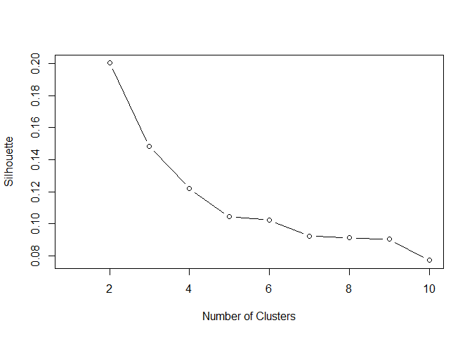
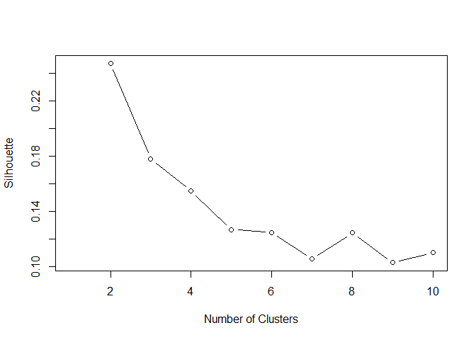
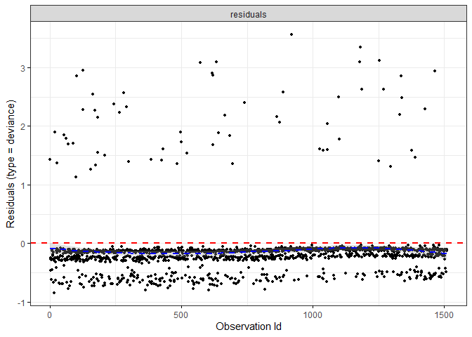
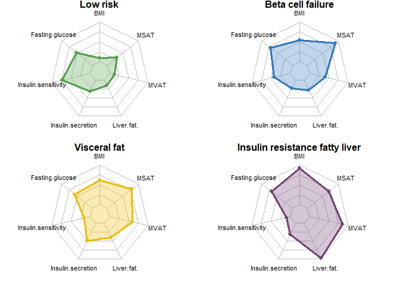
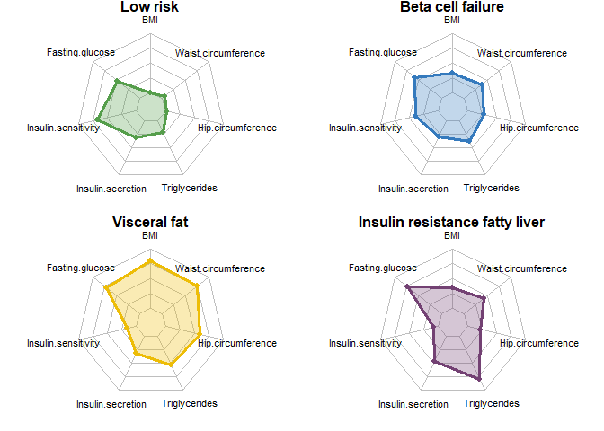

# Load data


# Data cleaning

## Exclusion criteria and implausibe values

``` r
# subset to remove participants
df_sub <- subset(df, 
                 diab_prev == 0 &       # remove prev T2D
                 #t2d_30d ==0    &       # remove T2D within 30 days
                 nuchter ==1    &       # remove non fasting participants
                 devmeal ==0    &       # remove partial or full meal deviations
                 eind2  !=8             # remove loss-to-follow-up  
)


# Create indices for future references and merging
df_sub$ID <- seq.int(nrow(df_sub))

# Remove variables smaller than 0 when implausible
df_sub$Insuline_r1[df_sub$Insuline_r1 < 0] <- NA
df_sub$insuline_r2[df_sub$insuline_r2 < 0] <- NA
df_sub$insuline_r3[df_sub$insuline_r3 < 0] <- NA
df_sub$glucose1[df_sub$glucose_r1 < 0] <- NA
df_sub$glucose2[df_sub$glucose_r2 < 0] <- NA
df_sub$glucose3[df_sub$glucose_r3 < 0] <- NA
df_sub$Insuline_r1 <- as.numeric(df_sub$Insuline_r1)
df_sub$insuline_r2 <- as.numeric(df_sub$insuline_r2)
```


## Add insulin sensitivity and secretion

``` r
# Matsuda index -> insulin sensitivity
insulin_mean <- rowMeans(df_sub[, c("Insuline_r1", "insuline_r2", "insuline_r3")], na.rm=TRUE)     # mean insulin value for each participant
glucose_mean <- rowMeans(df_sub[, c("glucose1", "glucose2", "glucose3")], na.rm=TRUE)              # mean glucose value for each participant

ins_glc_0 <- df_sub$Insuline_r1 * df_sub$glucose1 * 18.01                                                # variables needed for Matsuda index                                 
ins_glc_mean <- insulin_mean * glucose_mean * 18.01

df_sub$Matsuda <-(10000/(sqrt((ins_glc_0*ins_glc_mean))))                                          # create Matsuda index  


df_sub$IR <- (df_sub$insuline_r2)/(df_sub$glucose2 * df_sub$bmim)                                  # insulin resistance
```


## Create clustering DFs

``` r
# TUEF/TULIP (more variables version)
df_T <- df_sub[,c("ID", "leeftijd", "sexe", "glucmet2bl", "bmim",       
                  "t2d_inc",                                                       
                  "Matsuda", "IR",  "AUCgluc1" ,                                
                  "hdlc1", "TG_perc", "MSAT", "MVAT" , "trig1", "choltot1", "middelomtrek", "heupomtrek", 
                   "Insuline_r1", "GRS_T2DM")]                       

df_T <- na.omit(df_T) # 1529 obs


# Whitehall (less variable version)
df_W <- df_sub[,c("ID","leeftijd", "sexe", "glucmet2bl", "bmim",     
                  "t2d_inc",                                                    
                   "Matsuda", "IR", "Insuline_r1",                        
                  "glucose1", "AUCgluc1",                                       
                  "trig1", "middelomtrek", "heupomtrek", "hdlc1")]                

df_W <- na.omit(df_W) # 5552 obs
```


# Get functions

``` r
source("00_functions.R")
```


# Cluster analysis
## Create variables for clustering

``` r
# set number of clusters to 4
cluno <- 4

# create variable with clustering variables
modeller <- c("MSAT_scld",
              "MVAT_scld",
              "Matsuda_scld",
              "IR_scld",
              "AUCgluc1_scld",
              "hdlc1_scld",
              "TG_perc_scld",
              "GRS_T2DM")

modeller_nonscaled <- str_replace_all(modeller,"_scld","")

# whitehall (another version)
modeller_w <- c("AUCgluc1_scld",
              "Matsuda_scld",
              "IR_scld",
              "Insuline_r1_scld",
              "trig1_scld",
              "middelomtrek_scld",
              "heupomtrek_scld",
              "bmim_scld",
              "hdlc1_scld")

modeller_nonscaled_w <- str_replace_all(modeller_w,"_scld","")

# create data set with needed variables
data.sh <- df_T %>% select(ID, leeftijd, sexe, glucmet2bl, bmim,       
                  t2d_inc,                                                  
                  Matsuda, IR,                                        
                  hdlc1, TG_perc, MSAT, MVAT, GRS_T2DM,
                  one_of(modeller_nonscaled))

data.anal <- data.sh %>% 
             ungroup() 

# whitehall
data.sh_w <- df_W %>% select(ID, leeftijd, sexe, glucmet2bl, bmim,       
                           t2d_inc, 
                           AUCgluc1, 
                           Matsuda, IR, Insuline_r1,                                     
                           hdlc1, trig1, middelomtrek, heupomtrek, 
                           one_of(modeller_nonscaled_w))

data.anal_w <- data.sh_w %>% 
  ungroup() 
```

## Prepare data

``` r
# use function to scale data sets
data.scld <- preparedata(data.anal)                           # TUEF
data.scld_w <- preparedata_w(data.anal_w)                     # Whitehall
```

## Cluster analysis

``` r
# data frame for clustering
modeling <- data.scld %>% 
        select(one_of(modeller)) 

modeling_w <- data.scld_w %>% 
  select(one_of(modeller_w)) 

# calculate gowers distances
gow_dist <- daisy(modeling, metric="gower")
gow_dist_w <- daisy(modeling_w, metric="gower")

data.scld_1 <- data.scld %>% select(one_of(modeller))
data.scld_w_1 <- data.scld_w %>% select(one_of(modeller_w))


# test silhouette width
sil_width <- c(NA)
for(i in 2:10){
  pam_fit <- pam(gow_dist,
                 diss = TRUE,
                 k = i)
  
  sil_width[i] <- pam_fit$silinfo$avg.width
}

sil_width_w <- c(NA)
for(i in 2:10){
  pam_fit_w <- pam(gow_dist_w,
                 diss = TRUE,
                 k = i)
  
  sil_width_w[i] <- pam_fit_w$silinfo$avg.width
}


# Elbow plot
plot(1:10, sil_width, type="b", xlab="Number of Clusters",
  ylab="Silhouette")
```

<!-- -->

``` r
plot(1:10, sil_width_w, type = "b", xlab = "Number of Clusters", ylab = "Silhouette")
```

<!-- -->

``` r
# pamk clustering prep
modeling.all <- data.scld %>% 
                ungroup() %>% 
            select(one_of(modeller)) 

modeling.all_w <- data.scld_w %>% 
  ungroup() %>% 
  select(one_of(modeller_w)) 
```


## Consensus clustering


``` r
myDistFunc = function(x){ daisy(x, metric="gower")} # use this as the distance matrix

#### slow step ####
# res_pam <- ConsensusClusterPlus(t(modeling.all),
#                                maxK = 8,
#                                reps = 100,
#                                pItem = 0.8, ## percent of sample to consider for clustering
#                                  pFeature = 1, ## percent of features to consider
#                                  plot = "png",
#                                  clusterAlg = "pam",
#                                  title = "../Output/consensus",
#                                  distance = "myDistFunc",
#                                  seed = 2023,
#                                  verbose = T)   
# calcICL(res_pam, title = "../Output/consensus_plots", plot = "png")
# 
# ### slow step ####
# res_pam_w <- ConsensusClusterPlus(t(modeling.all_w),
#                                    maxK = 8,
#                                    reps = 100,
#                                    pItem = 0.8, ## percent of sample to consider for clustering
#                                    pFeature = 1, ## percent of features to consider
#                                    plot = "png",
#                                    clusterAlg = "pam",
#                                    title = "pam_w",
#                                    distance = "myDistFunc",
#                                    seed = 2023,
#                                    verbose = T)    
#  calcICL(res_pam_w, title = "pam_w_plots")
```

# PAM clustering

``` r
cluno = 4
set.seed(25)
pam <- daisy(modeling.all, metric = "gower")
kc <- pam(pam,k=cluno)
centers <-  modeling.all[kc$medoids,]

pam_w <- daisy(modeling.all_w, metric = "gower")
kc_w <- pam(pam_w,k=cluno)
centers_w <-  modeling.all_w[kc_w$medoids,]

# create variables for plots
clusterplot <- bind_cols(newcluster = kc$cluster,modeling.all) %>% 
              left_join(data.scld) %>%
              select(ID, newcluster,sexe,leeftijd,bmim,
                     IR, 
                     one_of(modeller_nonscaled),one_of(modeller))
```

```
## Joining with `by = join_by(MSAT_scld, MVAT_scld, Matsuda_scld, IR_scld,
## AUCgluc1_scld, hdlc1_scld, TG_perc_scld, GRS_T2DM)`
```

``` r
clusterplot_w <- bind_cols(newcluster_w = kc_w$cluster,modeling.all_w) %>% 
  left_join(data.scld_w,) %>%
  select(ID, newcluster_w,sexe,leeftijd,
         bmim,
         IR, 
         one_of(modeller_nonscaled_w),one_of(modeller_w))
```

```
## Joining with `by = join_by(AUCgluc1_scld, Matsuda_scld, IR_scld,
## Insuline_r1_scld, trig1_scld, middelomtrek_scld, heupomtrek_scld, bmim_scld,
## hdlc1_scld)`
```

# Add clusternames

``` r
# set cluster to numeric
cluster.all <- clusterplot %>% 
              mutate(cluster = as.numeric(newcluster)) 

cluster.all_w <- clusterplot_w %>% 
  mutate(cluster_w = as.numeric(newcluster_w)) 


## if using 4 clusters instead of 6 clusters
cluster.all$c_name <- as.factor(ifelse(cluster.all$cluster == 1, 'IRFL',
                                  ifelse(cluster.all$cluster == 2, 'BCF',
                                  ifelse(cluster.all$cluster == 3, 'LR', 
                                  ifelse(cluster.all$cluster == 4, 'VF', NA)))))


cluster.all_w$c_name_w <- as.factor(ifelse(cluster.all_w$cluster_w == 1, 'BCF',
                                  ifelse(cluster.all_w$cluster_w == 2, 'IRFL',
                                  ifelse(cluster.all_w$cluster_w == 3, 'VF', 
                                  ifelse(cluster.all_w$cluster_w == 4, 'LR',NA)))))
```


# Survival analysis
## Kaplan meier

``` r
# new data set including clusters and all other variables
df_surv <- merge(df_sub, cluster.all, by = "ID")
df_surv_w <- merge(df_sub, cluster.all_w, by = "ID")

# incorporate diabetes diagnosis time
df_surv$time <- difftime(df_surv$einddatum2, df_surv$visitdd, units = "days")
df_surv$time_diab <- difftime(df_surv$diabetes2_date, df_surv$visitdd, units = "days")

df_surv <- df_surv %>%
  mutate(time_diab = coalesce(time_diab, time))
df_surv$time_y <- as.numeric(df_surv$time_diab/365.25)   # change to year (divided by 365.25)

# same for whitehall
df_surv_w$time_w <- difftime(df_surv_w$einddatum2, df_surv_w$visitdd, units = "days")
df_surv_w$time_diab_w <- difftime(df_surv_w$diabetes2_date, df_surv_w$visitdd, units = "days")

df_surv_w <- df_surv_w %>%
  mutate(time_diab_w = coalesce(time_diab_w, time_w))

df_surv_w$time_y <- as.numeric(df_surv_w$time_diab_w/365.25)   # change to year

table(df_surv$cluster, df_surv$t2d_inc)
```

```
##    
##       0   1
##   1 237  46
##   2 461  13
##   3 392   2
##   4 356   3
```

``` r
table(df_surv_w$cluster_w, df_surv_w$t2d_inc)
```

```
##    
##        0    1
##   1 1926   35
##   2  871   76
##   3 1019  138
##   4 1163    7
```

# Create surv objects

``` r
surv_object <- Surv(df_surv$time_y, df_surv$t2d_inc)        # create surv object
fit1 <- survfit(surv_object ~ c_name, data = df_surv)       # create plot object


surv_object_w <- Surv(df_surv_w$time_y, df_surv_w$t2d_inc)
fit1_w <- survfit(surv_object_w ~ c_name_w, data = df_surv_w)
```


# Plot kaplan meier

``` r
splots <- list()

par(pty = "s")
p1 <-  ggsurvplot(fit1, fun = function(x) 1 -x, data = df_surv, title = "Original list", pval = TRUE, palette = c("#7dadd4","#8f6799","#88c584","#E7B800"), censor.size = 0.05, xlab = "years", ylab = "T2DM cumulative incidence", font.y = 10, font.x = 10, font.title = 10, font.caption = 8, font.tickslab = 8, pval.size = 3, legend.labs = levels(df_surv$c_name))
 
p2 <- ggsurvplot(fit1_w, fun = function(x) 1 -x, data = df_surv_w, pval = TRUE, title = "Proxy list" ,palette = c("#7dadd4", "#8f6799", "#88c584", "#e7b800"), censor.size = 0.05, xlab = "years", ylab = "T2DM cumulative incidence", font.y = 10,font.x = 10,  font.title = 10, font.caption = 8, font.tickslab = 8, pval.size =3, legend.labs = levels(df_surv_w$c_name_w))


# create combined plot
combined_plot <- p1$plot/p2$plot

plot_surv <- (p1$plot + p2$plot) / guide_area() + 
  plot_layout(guides = 'collect')

ggsave("../Output/plot_survival_original.png", combined_plot, width = 5, height = 8, dpi = 500)
```

# Cox regression


``` r
# relevel to make low risk cluster

df_surv$c_name <- relevel(df_surv$c_name, ref = "LR")
df_surv_w$c_name_w <- relevel(df_surv_w$c_name_w, ref = "LR")

# cox regression
fit.coxph <- coxph(surv_object ~ c_name,
                   data = df_surv)                  # crude
fit.coxph
```

```
## Call:
## coxph(formula = surv_object ~ c_name, data = df_surv)
## 
##               coef exp(coef) se(coef)     z        p
## c_nameBCF   1.6337    5.1226   0.7598 2.150   0.0315
## c_nameIRFL  3.4814   32.5064   0.7226 4.818 1.45e-06
## c_nameVF    0.4361    1.5466   0.9131 0.478   0.6329
## 
## Likelihood ratio test=97.37  on 3 df, p=< 2.2e-16
## n= 1510, number of events= 64
```

``` r
fit.coxph_conf <-coxph(surv_object ~ c_name + leeftijd.x + bmim.x + sexe.x,
                   data = df_surv )                # with confounders


# cox regression proxy list
fit.coxph_w <- coxph(surv_object_w ~ c_name_w , data = df_surv_w)  # crude
fit.coxph_w_conf <- coxph(surv_object_w ~ c_name_w  + leeftijd.x + sexe.x, data=as.data.frame(df_surv_w)) #with confounders, no BMI because BMI is in cluster
```


``` r
# forest plot TUEF
forest <- ggforest(fit.coxph, data = df_surv, main = "TUEF without confounder correction")
forest_conf <- ggforest(fit.coxph_conf, data = df_surv, main = "TUEF with confounder correction")


# forest plot WH
forest_w <- ggforest(fit.coxph_w, data = df_surv_w, main = "Whitehall without confouder correction")
forest_w_conf <- ggforest(fit.coxph_w_conf, data = df_surv_w, main = "Whitehall with confouder correction")
```


## Testing assumptions 

``` r
## proportional hazards

cox_zph <- cox.zph(fit.coxph_conf)
cox_zph
```

```
##             chisq df    p
## c_name     1.9534  3 0.58
## leeftijd.x 0.0272  1 0.87
## bmim.x     1.9362  1 0.16
## sexe.x     1.1329  1 0.29
## GLOBAL     4.1192  6 0.66
```

``` r
cox_zph_norm <- cox.zph(fit.coxph)
cox_zph_norm
```

```
##        chisq df   p
## c_name  1.88  3 0.6
## GLOBAL  1.88  3 0.6
```

``` r
cox_zph_w <- cox.zph(fit.coxph_w_conf)
cox_zph_w
```

```
##            chisq df    p
## c_name_w   3.070  3 0.38
## leeftijd.x 0.779  1 0.38
## sexe.x     0.406  1 0.52
## GLOBAL     4.138  5 0.53
```

``` r
## influencial 
ggcoxdiagnostics(fit.coxph_conf, type = "deviance",
                 linear.predictions = FALSE, ggtheme = theme_bw())
```

```
## `geom_smooth()` using formula = 'y ~ x'
```

<!-- -->


## Sensitivity analysis

``` r
## sensitivity analysis
fit.coxph_conf_sens <-coxph(surv_object ~ c_name + leeftijd.x + bmim.x + sexe.x + totmeth + Pittstotal + dhd15_finalscore + smoking, 
                   data = df_surv )                # with confounders

fit.coxph_w_conf_sens <-coxph(surv_object_w ~ c_name_w + leeftijd.x + sexe.x + totmeth + Pittstotal + dhd15_finalscore + smoking, 
                   data = df_surv_w ) 

forest_conf_sens <- ggforest(fit.coxph_conf_sens, data = df_surv, main = "TUEF with confounder correction")
forest_w_conf_sens  <- ggforest(fit.coxph_w_conf_sens, data = df_surv_w, main = "Whitehall with confouder correction")

cox_zph_s <- cox.zph(fit.coxph_conf_sens)
cox_zph_w_s <- cox.zph(fit.coxph_w_conf_sens)
```


## Write results

``` r
cox_results <- list(fit.coxph, fit.coxph_conf, fit.coxph_w, fit.coxph_w_conf) %>% 
   lapply(function(x) tidy(x, exponentiate = T, conf.int = T)) %>% do.call(rbind, .) 
 
write.xlsx(cox_results, file = "../Output/cox_results.xlsx", rowNames = F)
```

 

# Cluster stability and concordance

## Sankey plot

``` r
if (!requireNamespace("BiocManager", quietly = TRUE))
    install.packages("BiocManager")

BiocManager::install("scmap", update = FALSE)
```

```
## Bioconductor version 3.19 (BiocManager 1.30.23), R 4.4.0 (2024-04-24 ucrt)
```

``` r
library(scmap)

# create dataframe for sankey plot between clusters

df_sankey <- merge(df_surv, df_surv_w, by = "ID")
selected_columns <- c("c_name", "c_name_w", "ID")
df_sankey <- df_sankey[,selected_columns]


# create sankey plot
sankey <- getSankey(df_sankey$c_name, df_sankey$c_name_w, plot_width = 400, plot_height = 600,
  colors = c("#357ABD", "#559E4B", "#734173", "#edbd08"))
plot(sankey)
```

```
## starting httpd help server ...
```

```
##  done
```

``` r
# count numbers
same_group <- sum(df_sankey$c_name == df_sankey$c_name_w)
different_group <- sum(df_sankey$c_name != df_sankey$c_name_w)
transfer_matrix <- table(df_sankey$c_name, df_sankey$c_name_w)

cat("Number of individuals staying in the same group:", same_group, "\n")
```

```
## Number of individuals staying in the same group: 736
```

``` r
cat("Number of individuals transferring to different groups:", different_group, "\n")
```

```
## Number of individuals transferring to different groups: 770
```

``` r
print("Transfer matrix:")
```

```
## [1] "Transfer matrix:"
```

``` r
print(transfer_matrix)
```

```
##       
##         LR BCF IRFL  VF
##   LR   285  99    2   8
##   BCF   74 285   49  66
##   IRFL   0  39  101 142
##   VF    15 137  139  65
```

``` r
write.xlsx(transfer_matrix, file = "../Output/sankey_numbers.xlsx", rowNames = F)
```


# Cluster stability
## Original list


``` r
# Determine the stability
# 1. KMeans(pam clustering)
data.scld_1 <- data.scld %>% select(one_of(modeller))

# use distance matrix as inputs
res_post_noDM_stable_kmeans <- clusterboot(gow_dist, distances = T,
                                           B = 100, bootmethod = c("boot"), 
                                           clustermethod = pamkCBI,
                                           seed = 123,
                                           count = FALSE,
                                           k = 4) 

temp <- res_post_noDM_stable_kmeans$bootresult %>% t() %>% data.frame() %>% 
  dplyr::rename(Cluster1 = X1,
         Cluster2 = X2,
         Cluster3 = X3,
         Cluster4 = X4
  )

## Using gather function to change wide data to long
temp_long <- gather(temp, Cluster, Value, Cluster1:Cluster4)

str(temp_long)
```

```
## 'data.frame':	400 obs. of  2 variables:
##  $ Cluster: chr  "Cluster1" "Cluster1" "Cluster1" "Cluster1" ...
##  $ Value  : num  0.668 0.618 0.859 0.568 0.675 ...
```

``` r
## Calculate mean, sd, se, and IC
temp_long <- temp_long  %>% 
  dplyr::group_by(Cluster) %>% 
  summarise(n = n(),
            mean = mean(Value),
            sd = sd(Value)) %>% 
  mutate(se = sd/sqrt(n)) %>%
  mutate(ic = se * qt((1-0.05)/2 + .5, n-1)) 

## Barplot
Jaccard_KM <- ggplot(temp_long, aes(x = Cluster, y = mean, fill = Cluster)) +
  geom_bar(stat = "identity", alpha = 0.5, width = 0.5) +
  geom_errorbar(aes(x = Cluster, ymin = mean-ic, ymax = mean+ic), width = 0.2, color = "black", alpha = 0.6, size = 1) +
  labs(x = NULL, y = "Jaccard Index") + theme_bw()
```

## Proxy list


``` r
# Determine the stability
# 1. KMeans -> pamk cluster -> distance change to (gower distance)
data.scld_w_1 <- data.scld_w %>% select(one_of(modeller_w))

res_post_noDM_stable_kmeans_w <- clusterboot(gow_dist_w, 
                                             distances = T,
                                             B = 100, bootmethod = c("boot"), 
                                             clustermethod = pamkCBI,
                                             seed = 123, count = FALSE,
                                             k = 4) 

temp_w <- res_post_noDM_stable_kmeans_w$bootresult %>% t() %>% data.frame() %>% 
  dplyr::rename(Cluster1 = X1,
         Cluster2 = X2,
         Cluster3 = X3,
         Cluster4 = X4)


## Using gather function to change wide data to long
temp_long_w <- gather(temp_w, Cluster, Value, Cluster1:Cluster4)

## Calculate mean, sd, se, and IC
temp_long_w <- temp_long_w %>% 
  group_by(Cluster) %>% 
  summarise(n = n(),
            mean = mean(Value),
            sd = sd(Value)) %>% 
  mutate(se = sd/sqrt(n)) %>%
  mutate(ic = se * qt((1-0.05)/2 + .5, n-1))

## Barplot
Jaccard_KM_w <- ggplot(temp_long_w, aes(x = Cluster, y = mean, fill = Cluster)) +
  geom_bar(stat = "identity", alpha = 0.5, width = 0.5) +
  geom_errorbar(aes(x = Cluster, ymin = mean-ic, ymax = mean+ic), width = 0.2, color = "black", alpha = 0.6, size = 1) +
  labs(x = NULL, y = "Jaccard Index - ") + theme_bw()


par(mfrow = c(2,1))
```

## Print plots

``` r
combined_plot_J <- Jaccard_KM / Jaccard_KM_w


ggsave("../Output/plot_stability.png", combined_plot_J, width = 5, height = 8, dpi = 500)
```

 


# Metabolomics

``` r
source("00_functions.R")
```


## Exclude metabolite ratios and postprandial


``` r
# new df with cluster assignment and all metabolites
df_rf <- df_surv %>% select(XXLVLDLP_1:Gp_3, cluster)

df_rf_w <- df_surv_w %>% select(XXLVLDLP_1:Gp_3, cluster_w)


# import file with variable names that should be excluded
metab_exc <- read.csv("../Data/Metabolite_Ratios_list.csv")
metab_exc_v <- metab_exc$x

# also exclude postprandial
post_pran <- names(df_rf)[endsWith(names(df_rf), "_3")]

# combine metab and postprandial
metab_pran <- union(metab_exc_v, post_pran)


# make df with fasting and postprandial
df_rf_fp <- df_rf %>%
  select(!all_of(metab_exc_v))
```


``` r
# Replace any value <= 0 with NA
df_rf_fp <- df_rf_fp %>% mutate_at(vars(XXLVLDLP_1:Gp_3), ~ifelse(.<=0,NA,.))       # for fasting and postprandial
 

w_2 <- apply(df_rf_fp[,c(1:296)], 2, function(x) is_outlier(x, nSD = 5)) # list: 296 metabolites, more than 5 SD


# Replace outliers with NA - fasting and postprandial
for (i in names(w_2)) {
  a <- w_2[[i]]
  if (!is.null(a)){
    df_rf_fp[a, i] <- NA
  }
}
```


### Remove missings in individuals (>40%)


``` r
df_rf_fp$fmis_sample = apply(df_rf_fp, 1,  function(x) { sum(is.na(x)) / length(x)})
df_rf_fp <- subset(df_rf_fp, fmis_sample <= 0.4)

df_rf_fp <- df_rf_fp %>% select(c(XXLVLDLP_1:cluster),)
```


``` r
# Filter metabolites with >10% missing
fmis = apply(df_rf_fp, 2,  function(x) {sum(is.na(x)) / length(x)})

# Filter samples
fmis_df <- as.data.frame(fmis)
fmis_df <- fmis_df %>% rownames_to_column(var = "Meta_status")
fmis_df$Group <-  str_split(fmis_df$Meta_status, "_", simplify = T)[,2]
fmis_df$Group <- ifelse(fmis_df$Group == "1", "Fasting_state", "Postprandial_state")
fmis_df <- fmis_df[order(fmis_df$fmis),]
fmis_df  <- fmis_df %>% 
  group_by(Group) %>% 
  arrange(desc(fmis)) %>% 
  ungroup()


w = which(fmis > 0.1) # 20 metabolites with missing rate > 10%
Removemetabolites <- names(w) 
Removemetabolites_fasting <- Removemetabolites[grep("_1", Removemetabolites)] # in the fasting
Removemetabolites_postprandial <- Removemetabolites[grep("_3", Removemetabolites)] # in the postprandial


df_fp <- df_rf_fp %>% 
  select(!any_of(Removemetabolites))
```


``` r
# Scaling
df_rf_met_num <- df_fp %>% 
   mutate_at(c(1:272), as.numeric) %>%
  mutate_at(c(1:272), funs(c(scale(.))))


## Impute low values
# impute with min/2

df_rf_tot <- impute_min2(df_rf_met_num)

## fasting
post_pran <- names(df_rf_tot)[endsWith(names(df_rf_tot), "_3")]
df_rf_met <- df_rf_tot %>% select(!all_of(post_pran))
```


## Random forest

``` r
set.seed(71)

df_rf_met$cluster_b <- as.factor(ifelse(df_rf_met$cluster == "2", "1", "2"))             # beta cell failure, 1 = high risk, 2 = all others
df_rf_met$cluster_hrv <- as.factor(ifelse(df_rf_met$cluster == "4", "1", "2"))           # high risk visceral fat
df_rf_met$cluster_hri <- as.factor(ifelse(df_rf_met$cluster == "1", "1", "2"))           # high risk insulin resistance


# Beta cell failure
df_rf_b <- df_rf_met %>%  select(LVLDLP_1:Gp_1, cluster_b)
rf_b <-randomForest(cluster_b~.,data=df_rf_b, ntree=500, localImp = TRUE) 


r_imp_b <- importance(rf_b)
#plot_test_b <- varImpPlot(rf_b, pch = 5, col = "blue", main = "RF variable importance Tuef/beta cell", cex = 0.6)

importance_frame_b <-measure_importance(rf_b)


# High risk visceral fat
df_rf_hrv <- df_rf_met %>% select(LVLDLP_1:Gp_1, cluster_hrv)
rf_hrv <-randomForest(cluster_hrv~.,data=df_rf_hrv, ntree=500, localImp = TRUE) 
importance_frame_hrv <-measure_importance(rf_hrv)
r_imp_hrv <- importance(rf_hrv)


# HR IR
df_rf_hri <- df_rf_met %>% select(LVLDLP_1:Gp_1, cluster_hri)
rf_hri <-randomForest(cluster_hri~.,data=df_rf_hri, ntree=500, localImp = TRUE) 

r_imp_hri <- importance(rf_hri)
importance_frame_hri <-measure_importance(rf_hri)


## Create table with top 20

# beta cell
df_met20_b <- importance_frame_b %>%
   select(variable, accuracy_decrease)
sorted_data_b <- df_met20_b[order(-df_met20_b$accuracy_decrease),]
top_20_b <- sorted_data_b %>%
  slice_head(n=10) %>%
  select(variable)


# HRV
df_met20_hrv <- importance_frame_hrv %>%
   select(variable, accuracy_decrease)
sorted_data_hrv <- df_met20_hrv[order(-df_met20_hrv$accuracy_decrease),]

top_20_hrv <- sorted_data_hrv %>%
     slice_head(n=10) %>%
     select(variable)

# HRI
df_met20_hri <- importance_frame_hri %>%
   select(variable, accuracy_decrease)
sorted_data_hri <- df_met20_hri[order(-df_met20_hri$accuracy_decrease),]

top_20_hri <- sorted_data_hri %>%
  slice_head(n=10) %>%
  select(variable)


df_rf_tot_withoutipvs <- data.frame(top_20_b, top_20_hrv, top_20_hri)
```

# Table metabolomics output
### Total table

``` r
# Create dataframe with all top 20s for TUEF and WH
df_rf_tot <- data.frame(top_20_b, top_20_hrv, top_20_hri)

# change to character
df_rf_tot %>% mutate(across(everything(), as.character))
```

```
##     variable variable.1 variable.2
## 1      Glc_1   LHDLFC_1      Glc_1
## 2      Leu_1   XLHDLL_1   LVLDLP_1
## 3      Ile_1  XLHDLPL_1  LVLDLPL_1
## 4       Gp_1       Gp_1  LVLDLFC_1
## 5  MVLDLPL_1    LHDLC_1   LVLDLC_1
## 6  SVLDLPL_1    LHDLL_1      Tyr_1
## 7  MVLDLTG_1   LHDLCE_1   LVLDLL_1
## 8   XLHDLP_1   XLHDLP_1  MVLDLFC_1
## 9    LHDLP_1     HDLD_1  MVLDLPL_1
## 10  LHDLCE_1      Glc_1       Gp_1
```

``` r
# delete rownames
rownames(df_rf_tot) <- NULL

# create titles for columns
titles_rf <- c("Beta_cell_failure", "HR_visceral_fat", "HR_insulin_resistance")
colnames(df_rf_tot) <- titles_rf

# print table
df_rf_tot
```

```
##    Beta_cell_failure HR_visceral_fat HR_insulin_resistance
## 1              Glc_1        LHDLFC_1                 Glc_1
## 2              Leu_1        XLHDLL_1              LVLDLP_1
## 3              Ile_1       XLHDLPL_1             LVLDLPL_1
## 4               Gp_1            Gp_1             LVLDLFC_1
## 5          MVLDLPL_1         LHDLC_1              LVLDLC_1
## 6          SVLDLPL_1         LHDLL_1                 Tyr_1
## 7          MVLDLTG_1        LHDLCE_1              LVLDLL_1
## 8           XLHDLP_1        XLHDLP_1             MVLDLFC_1
## 9            LHDLP_1          HDLD_1             MVLDLPL_1
## 10          LHDLCE_1           Glc_1                  Gp_1
```

``` r
write.csv(df_rf_tot, file = "../Output/RF_outcomes_metab.csv")
```


 

# Proteomics

## Set up

``` r
df_prot <- df_surv %>% select(c(IL2:NME3, cluster))

## change to numeric and remove NAs for RF
df_rf_prot <- df_prot %>% 
  mutate_at(c(1:363), as.numeric) %>%
  filter_at(vars(1:363), all_vars(!is.na(.))) #%>%
  #mutate_at(c(1:363), funs(c(scale(.))))
```

## Random forest for proteins
# Random forest for proteins


``` r
set.seed(21)

df_rf_prot$cluster_b <- as.factor(ifelse(df_rf_prot$cluster == "2", "1", "2"))             # beta cell failure, 1 = high risk, 2 = all others
df_rf_prot$cluster_hrv <- as.factor(ifelse(df_rf_prot$cluster == "4", "1", "2"))           # high risk visceral fat
df_rf_prot$cluster_hri <- as.factor(ifelse(df_rf_prot$cluster == "1", "1", "2"))           # high risk insulin resistance


# Beta cell failure

df_rf_prot_b <- df_rf_prot %>%  select(IL2:NME3, cluster_b)
rf_b <-randomForest(cluster_b~.,data=df_rf_prot_b, ntree=500, localImp = TRUE) 


r_imp_b <- importance(rf_b)
#plot_test_b <- varImpPlot(rf_b, pch = 5, col = "blue", main = "RF variable importance Tuef/beta cell", cex = 0.6)

importance_frame_b <-measure_importance(rf_b)


# High risk visceral fat
df_rf_prot_hrv <- df_rf_prot %>% select(IL2:NME3, cluster_hrv)
rf_hrv <-randomForest(cluster_hrv~.,data=df_rf_prot_hrv, ntree=500, localImp = TRUE) 
importance_frame_hrv <-measure_importance(rf_hrv)
r_imp_hrv <- importance(rf_hrv)


# HR IR
df_rf_prot_hri <- df_rf_prot %>% select(IL2:NME3, cluster_hri)
rf_hri <-randomForest(cluster_hri~.,data=df_rf_prot_hri, ntree=500, localImp = TRUE) 
r_imp_hri <- importance(rf_hri)
importance_frame_hri <-measure_importance(rf_hri)


## Create table with top 20

# beta cell
df_met20_b <- importance_frame_b %>%
   select(variable, accuracy_decrease)
sorted_data_b <- df_met20_b[order(-df_met20_b$accuracy_decrease),]
top_20_prot_b <- sorted_data_b %>%
  slice_head(n=10) %>%
  select(variable)


# HRV
df_met20_hrv <- importance_frame_hrv %>%
   select(variable, accuracy_decrease)
sorted_data_hrv <- df_met20_hrv[order(-df_met20_hrv$accuracy_decrease),]

top_20_prot_hrv <- sorted_data_hrv %>%
     slice_head(n=10) %>%
     select(variable)

# HRI
df_met20_hri <- importance_frame_hri %>%
   select(variable, accuracy_decrease)
sorted_data_hri <- df_met20_hri[order(-df_met20_hri$accuracy_decrease),]

top_20_prot_hri <- sorted_data_hri %>%
  slice_head(n=10) %>%
  select(variable)


df_rf_tot_prot <- data.frame(top_20_prot_b, top_20_prot_hrv, top_20_prot_hri)
```
# Results rf

``` r
# change to character
df_rf_tot_prot %>% mutate(across(everything(), as.character))
```

```
##    variable variable.1 variable.2
## 1     SHMT1      EGLN1        MVK
## 2     IL1RN    TNFSF13      IL1RN
## 3     EGLN1        HGF        HGF
## 4     FABP1      CXCL1      SHMT1
## 5       MVK      TIMP3       PON3
## 6      CD70      FCRL6       TPP1
## 7     PTPN6        MVK       KYNU
## 8   SULT2A1      CD244     LGALS9
## 9       IL6       NPPC    HSD11B1
## 10    IRAK4       PON3       LHPP
```

``` r
# delete rownames
rownames(df_rf_tot_prot) <- NULL

# create titles for columns
titles_rf_prot <- c("Beta_cell_failure", "HR_visceral_fat", "HR_insulin_resistance")
colnames(df_rf_tot_prot) <- titles_rf_prot

# print table
df_rf_tot_prot
```

```
##    Beta_cell_failure HR_visceral_fat HR_insulin_resistance
## 1              SHMT1           EGLN1                   MVK
## 2              IL1RN         TNFSF13                 IL1RN
## 3              EGLN1             HGF                   HGF
## 4              FABP1           CXCL1                 SHMT1
## 5                MVK           TIMP3                  PON3
## 6               CD70           FCRL6                  TPP1
## 7              PTPN6             MVK                  KYNU
## 8            SULT2A1           CD244                LGALS9
## 9                IL6            NPPC               HSD11B1
## 10             IRAK4            PON3                  LHPP
```

``` r
write.csv(df_rf_tot_prot, file = "../Output/RF_outcomes_prot.csv")
```

 

# All outputs
In this file, all tables and figures that were not computed yet will be added.
All output files (also from the other Rmd files) can be found in the /Output directory. 


# Metabolomics

``` r
source("00_functions.R")
```

# Set up

``` r
df_test2 <- merge(df_surv, df_T)
df_test3 <- merge(df_surv_w, df_W)
```

# Baseline tables (table 1)

``` r
table1_original <- table1(~ leeftijd + bmim+ middelomtrek + heupomtrek + glucose1 + Matsuda + IR + trig1 + hdlc1  | factor(sexe), data = df_test2)


table1_proxy <- table1(~ leeftijd + bmim+ middelomtrek + heupomtrek + glucose1 + Matsuda + IR + trig1 + hdlc1  |factor(sexe), data = df_test3)


tabs <- list(table1_original, table1_proxy)
lapply(tabs, as_tibble) |>
  write.xlsx(file = "../Output/Table1.xlsx")
```


# Baseline table for each cluster

``` r
table1_cluster <- table1(~ leeftijd + bmim+ middelomtrek + heupomtrek + glucose1 + Matsuda + IR + trig1 + hdlc1  | factor(c_name), data = df_test2)


table1_cluster_proxy <- table1(~ leeftijd + bmim+ middelomtrek + heupomtrek + glucose1 + Matsuda + IR + trig1 + hdlc1  |factor(c_name_w), data = df_test3)


tabs <- list(table1_cluster, table1_cluster_proxy)
lapply(tabs, as_tibble) |>
  write.xlsx(file = "../Output/Table1_cluster.xlsx")
```


# Radar plot original list

``` r
set.seed(1)

data_radar <- df_test2 %>% select(c(c_name, bmim, glucose1, Matsuda, IR, TG_perc, MVAT, MSAT))

### test
data_rp <- data.frame(
  row.names = c("Low risk", "Beta cell failure", "Visceral fat","Insulin resistance fatty liver"),
  BMI = c(25.7, 29.4, 29.9, 32.4),
  "Fasting glucose" = c(5.12, 6.24, 5.43, 6.05),
  "Insulin sensitivity" = c(9.31, 6.24, 3.67, 2.93),
  "Insulin secretion" = c(0.32, 0.23, 0.50, 0.32),
  "Liver fat%" = c(3.00, 5.43, 8.07, 19.5),
  MVAT = c(68.8, 111, 140, 178),
  MSAT = c(221, 356, 331, 308)
)

max_min <- data.frame(
  BMI = c(33, 25),
  "Fasting glucose" = c(8, 2),
  "Insulin sensitivity" = c(12, 2),
  "Insulin secretion" = c(1, 0),
  "Liver fat%" = c(20, 0),
  MVAT = c(200, 50),
  MSAT = c(380, 150)
)
rownames(max_min) <- c("Max", "Min")

df_rp_test <- rbind(max_min, data_rp)


## plot radar chart
  
# Define the colors
brighter_darker_colors <- c("#559E4B","#357ABD","#edbd08", "#734173")

# Use the defined colors for borders and fills with alpha transparency
colors_border <- brighter_darker_colors
colors_in <- sapply(brighter_darker_colors, function(col) adjustcolor(col, alpha.f = 0.3))
  

title <- c("Low risk", "Beta cell failure","Visceral fat", "Insulin resistance fatty liver")

par(mar = rep(0.8, 4))
par(mfrow= c(2,2))


for(i in 1:4){

  # Custom the radarChart
  radarchart(df_rp_test[c(1,2,i+2),], #axistype=0, 
  
    #custom polygon
    pcol=colors_border[i] , pfcol=colors_in[i] , plwd=3, plty=1 , 
  
    #custom the grid
    cglcol="grey", cglty=1, axislabcol="grey", caxislabels=seq(0,20,5), cglwd=0.8,
  
    #custom labels
    vlcex=0.8,
    
    #title
    title=title[i]
    )
}
```

<!-- -->
# Radar plot proxy

``` r
set.seed(2)


### test
data_rp_w <- data.frame(
  row.names = c("Low risk", "Beta cell failure", "Visceral fat", "Insulin resistance fatty liver"),
  BMI = c(24.9, 29.3, 35.4, 29.5),
  "Fasting glucose" = c(5.19, 5.43, 5.76, 5.80),
  "Insulin sensitivity" = c(9.42, 6.31, 3.73, 2.85),
  "Insulin secretion" = c(0.32, 0.29, 0.32, 0.46),
  "Triglycerides" = c(0.92, 1.26, 1.57, 2.08),
  "Hip circumference" = c(101, 110, 121, 108),
  "Waist circumference" = c(87.3, 100, 115, 102)
)

max_min_w <- data.frame(
  BMI = c(38, 25),
  "Fasting glucose" = c(6.5, 4),
  "Insulin sensitivity" = c(13, 2),
  "Insulin secretion" = c(1, 0),
  "Triglycerides" = c(2.5, 0.5),
  "Hip circumference" = c(135, 100),
  "Waist circumference" = c(125, 85)
)
rownames(max_min_w) <- c("Max", "Min")

df_rp_test_w <- rbind(max_min_w, data_rp_w)


title <- c("Low risk", "Beta cell failure","Visceral fat", "Insulin resistance fatty liver")
par(mar = rep(0.8, 4))
par(mfrow= c(2,2))


for(i in 1:4){

  # Custom the radarChart
  radarchart(df_rp_test_w[c(1,2,i+2),], #axistype=0, 
  
    #custom polygon
    pcol=colors_border[i] , pfcol=colors_in[i] , plwd=3, plty=1 , 
  
    #custom the grid
    cglcol="grey", cglty=1, axislabcol="grey", caxislabels=seq(0,20,5), cglwd=0.8,
  
    #custom labels
    vlcex=0.8,
    
    #title
    title=title[i]
    )
}
```

<!-- -->

# Lifestyle factors table

``` r
df_test2$mid_point <- (df_surv$opstatijd-(df_surv$tijd_in_bed/2))/3600 # define midpoint of sleep


table_ls <- table1(~ smoking + dhdi + alc_g + totmeth + leismeth + Pittstotal + mid_point + IDS_total_score| c_name, data = df_test2)
```

## Boxplots metabolites

``` r
new_levels <- c("LR","BCF", "VF", "IRFL")

# Reorder the factor levels
df_surv$c_name_plot <- factor(df_surv$c_name, levels = new_levels)

p_glc <- violin_plot(df_surv$Glc_1, "Glucose (mmol/L)", c(3,7))
p_ile <- violin_plot(df_surv$Ile_1, "Isoleucine (mmol/L)", c(0.02, 0.15))
p_leu <- violin_plot(df_surv$Leu_1, "Leucine (mmol/L)", c(0.04, 0.13))
p_gp <- violin_plot(df_surv$Gp_1, "Glycoprotein (mmol/L)", c(0.9, 2.0))

p_lhf <- violin_plot(df_surv$LHDLFC_1, "LHDLFC (mmol/L)", c(0.01, 0.2))
p_lhc <- violin_plot(df_surv$LHDLC_1, "LHDLC (mmol/L)", c(0.01, 0.8))
p_xlhdlp <- violin_plot(df_surv$XLHDLP_1, "XLHDLP (mmol/L)", c(0, 0.000001))
p_xlhdll <- violin_plot(df_surv$XLHDLL_1, "XLHDLL (mmol/L)", c(0.01,1))
p_lhdll <- violin_plot(df_surv$LHDLL_1, "LHDLL (mmol/L)", c(0.01, 1.8))
p_lhdlce <- violin_plot(df_surv$LHDLCE_1, "LHDLCE (mmol/L)", c(0.01, 0.7))
p_lhdlpl <- violin_plot(df_surv$LHDLPL_1, "LHDLPL (mmol/L)", c(0.01, 0.8))

p_vtg <- violin_plot(df_surv$VLDLTG_1, "VLDLTG (mmol/L)", c(0.2, 3))
p_mvpl <- violin_plot(df_surv$MVLDLPL_1, "MVLDLPL (mmol/L)", c(0.01, 0.4))
p_mvp <- violin_plot(df_surv$MVLDLP_1, "MVLDLP (mmol/L)", c(0, 0.00000007))
p_mvtg <- violin_plot(df_surv$MVLDLTG_1, "MVLDLTG (mmol/L)", c(0.01, 1))

p_lvl <- violin_plot(df_surv$LVLDLP_1, "LVLDLP (mmol/L)", c(0.0000000002, 0.00000002))
p_lvpl <- violin_plot(df_surv$LVLDLPL_1, "LVLDLPL (mmol/L)", c(0.01, 0.2))
p_lvtg <- violin_plot(df_surv$LVLDLTG_1, "LVLDLTG (mmol/L)", c(0.01, 0.8))
p_lvll <- violin_plot(df_surv$LVLDLL_1, "LVLDLL (mmol/L)", c(0.01, 1.2))


plot_violin_1 <- p_glc + p_ile + p_leu + p_gp + p_lhf + p_lhc + p_xlhdlp + p_xlhdll + 
               p_lhdll + p_lhdlce + p_lhdlpl + p_mvpl + plot_layout(ncol =4)
               
plot_violin_2 <-  p_mvp + p_mvtg +  p_vtg + p_lvl + p_lvpl + p_lvtg + p_lvll + plot_layout(ncol = 4)

ggsave("../Output/plot_violin_final.png", plot_violin_1, width = 26 , height = 17, dpi = 500, units = "cm")
ggsave("../Output/plot_violin_final_p2.png", plot_violin_2, width = 26, height = 12, dpi = 500, units = "cm")
```


